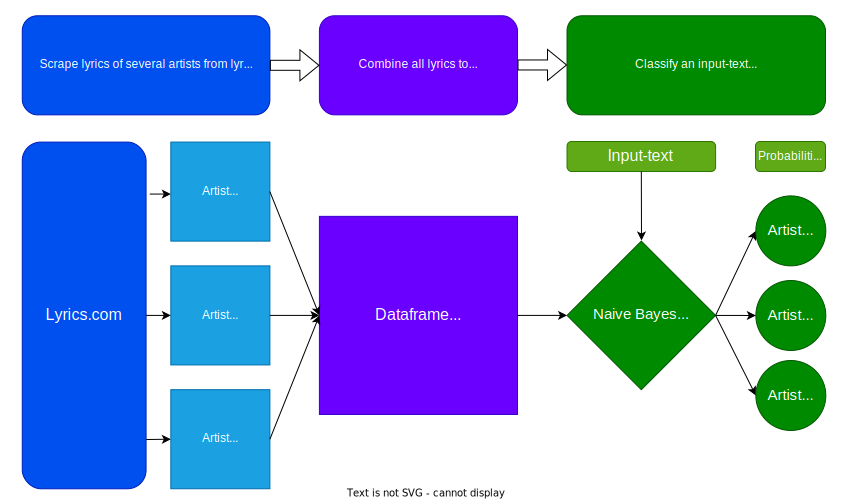

# Find out to which artist a song most likely belongs!
## Lyrics-classifier with command-line tools for: 
### 1. Scraping of all lyrics of chosen artists from [lyrics.com](https://www.lyrics.com)
### 2. Building a dataframe-file of all the scraped lyrics
### 3. Finding out to which of the artists a text-example most likely belongs (classify)
\


### A [Naive-Bayes Classification](https://scikit-learn.org/stable/modules/generated/sklearn.naive_bayes.MultinomialNB.html) is used on a [tf-idf-vectorized](https://scikit-learn.org/stable/modules/generated/sklearn.feature_extraction.text.TfidfVectorizer.html) lyrics-corpus (bag-of-words) with filtered and [lemmatized](https://www.nltk.org/_modules/nltk/stem/wordnet.html) words.
\
You can use the tools in __3__ steps:

### 1. Get Lyrics:
Choose 2-4 artists from Lyrics.com and copy the artist-urls.\
Download the lyrics for each artist with:
```bash
# python get_lyrics.py "artist_name" "url"
python get_lyrics.py eminem https://www.lyrics.com/artist/Eminem/
```
This will create a folder "eminem_lyrics" with all lyrics available as txt-files. As a song can exist in multiple versions, there can be several lyrics-files for one song. For better results, duplicates may be deleted before proceeding. 
You can take a few files out of the folder to use them with the classifier later.
\
&nbsp;
### 2. Add to Dataframe:
Add an artist's lyrics to the dataframe with:
```bash
# python add_to_dataframe.py "artist_name"
python add_to_dataframe.py eminem
```
Repeat for every chosen artist.
\
&nbsp;
### 3. Find out to which of the artists a text-example most likely belongs:
```bash
python classify_lyrics.py "May I have your attention please? Will the real Slim Shady please stand up?"
```
or
```bash
python classify_lyrics.py songname.txt
```
A whole song will perform much better than a small text-sample.

This project was part of the [Spiced Academy](https://www.spiced-academy.com) Data Science Bootcamp Nov/2021.